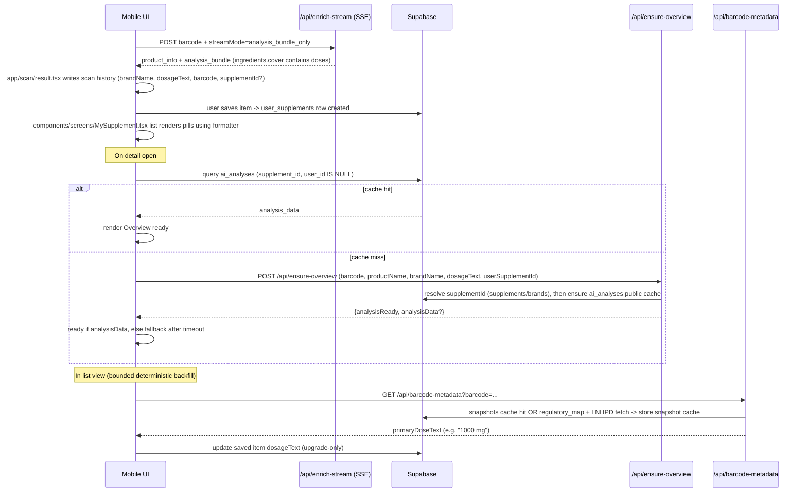

# My Supplement: Overview + Card Pills (Brand/Dosage) Stabilization

Date: 2026-02-10  
Owner: NutriApp team  
Status: Accepted / Implemented

## 1) PRD Summary

### Background (What Users Saw)
1. In **My Supplement** detail, the **Overview** section sometimes showed `Overview not available` or stayed in an infinite loading state.
2. On the **saved card cover**, the left pill often showed `Unknown brand`, or showed an overly long corporate string, or (worst case) a *wrong* sub-brand extracted from a corporate/group list.
3. The **dosage pill** sometimes showed full directions (e.g. `Adults: 1 tablet, 2 times daily`) instead of a short strength dose (e.g. `1000 mg`, `2000 IU`, `10B CFU`).

### Goals (Shippable Experience)
1. **Overview is always renderable** on detail open:
   - Show skeleton immediately.
   - Then show one stable final result:
     - Cached DeepSeek overview if available, otherwise rule-based (dev only), otherwise fallback.
   - No "low-quality text -> high-quality text" jump.
   - No infinite loading or unhandled `AbortError`.
2. **Brand pill** is readable and stable:
   - Clamp width in UI with ellipsis.
   - Apply a deterministic formatter that avoids mislabeling for corporate/group strings.
3. **Dosage pill** is short and correct:
   - Never show directions sentences.
   - Prefer strength dose (mg/mcg/g/IU/CFU/mL/oz) over count units (tablet/capsule).
   - Support common supplement units including IU/CFU and compact CFU (e.g. `10B CFU`).
4. **Cost control**:
   - DeepSeek is called only when detail is opened AND public cache is missing.
   - Deduplicate concurrent overview generation per supplement.

### Non-Goals
1. Not redesigning the entire supplement data model or adding new long-lived UI-specific fields (e.g. `brandDisplayName`).
2. Not using LLM for Brand/Dosage formatting (deterministic only).
3. Not performing large batch LLM backfills from list pages.

### Acceptance Criteria (Key Scenarios)
1. Any saved supplement detail open:
   - shows skeleton, then either ready content or fallback; never blocks forever.
2. Ester-C (`barcode=00029537001069`):
   - Brand pill: `Nestle Canada` (not `Vital Proteins`).
   - Dosage pill: `1000 mg` (not `1 tablet`).
3. Offline / API timeout:
   - No red screen; fallback UI appears.

## 2) Architecture (Where Data Comes From)

This feature spans **three layers**:
1. Mobile UI + local stores (scan history + saved supplements).
2. Backend endpoints for Overview cache and deterministic barcode metadata.
3. Supabase tables for canonical entities + caches.

### Key Frontend Components
- Scan SSE hook: `hooks/useStreamAnalysis.ts`
- Scan result writer: `app/scan/result.tsx`
- Saved list + detail sheet: `components/screens/MySupplement.tsx`
- Display formatter (Brand/Dose): `lib/supplementDisplay.ts`

### Key Backend Endpoints
- Streaming analysis for barcode scan:
  - `POST /api/enrich-stream` (SSE), supports `streamMode="analysis_bundle_only"`
  - Implementation: `backend/src/server.ts`
- Overview cache:
  - `POST /api/ensure-overview`
  - Implementation: `backend/src/server.ts`
- Deterministic barcode metadata (no LLM):
  - `GET /api/barcode-metadata?barcode=...`
  - Implementation: `backend/src/server.ts`

## 3) DB Tables (Fields We Rely On)

### Canonical Entities
From `supabase/migrations/20240608120000_initial_schema.sql`:

#### `public.brands`
- `id (uuid PK)`
- `name (text unique)`

#### `public.supplements`
- `id (uuid PK)`
- `brand_id (uuid FK -> brands.id)`
- `name (text)`
- `barcode (text nullable)` (note: barcode is not always present for all sources)
- `category (text nullable)`
- `image_url (text nullable)`
- `created_at`, `updated_at`

#### `public.user_supplements`
- `id (uuid PK)` (this is also the item id used by the app for saved supplements)
- `user_id (uuid)`
- `supplement_id (uuid FK -> supplements.id)` (may be backfilled by ensure-overview)
- `notes (text)` (used for user notes / optional fields)

### Caches

#### `public.ai_analyses`
From `supabase/migrations/20240608120000_initial_schema.sql`:
- `id (uuid PK)`
- `supplement_id (uuid FK)`
- `user_id (uuid nullable)`
  - **public cache** is defined as: `user_id IS NULL`
- `analysis_data (jsonb)` (used to store Overview fields rendered in detail)
- `created_at`

#### `public.snapshots`
From `supabase/migrations/20251228110000_snapshots.sql`:
- `id (text PK)` (snapshotId)
- `key (text)` (barcode gtin14, image hash, etc)
- `source (text)` (`barcode` / `label`)
- `payload_json (jsonb)` (SupplementSnapshot)
- `analysis_json (jsonb nullable)` (SnapshotAnalysisPayload)
- `updated_at`, `expires_at`

#### `public.barcode_regulatory_map`
From `supabase/migrations/20260131120000_barcode_resolution_engine_caches.sql`:
- `barcode_gtin14 (text PK)`
- `npn (text)` (Canada NPN, used to fetch LNHPD facts)
- `confidence (double)`
- `source (text)`
- `expires_at`

## 4) ADR: Decisions and Why

### Decision A: Overview Generation is Cache-First and Detail-Only
**Problem:** list-page backfill + "rule fallback then deepseek" caused cost spikes and perceived "jumping" quality.

**Decision:**
1. The app requests Overview only when detail is opened and public cache is missing:
   - `POST /api/ensure-overview`
2. Backend caches only DeepSeek output when `DEEPSEEK_API_KEY` is configured:
   - If DeepSeek fails, return `analysisReady=false` and do not write rule-based fallback to the public cache.
3. The UI is a strict three-state machine:
   - `loading` (skeleton)
   - `ready` (one-time final content)
   - `fallback` (local fallback + Retry)

**Why:** prevents "low quality -> high quality" jump and reduces LLM spend.

### Decision B: Brand/Dosage Pills Use Deterministic Display Formatter
**Problem:** raw brand/dose strings are often not UI-ready and can be misleading.

**Decision:**
- Use `lib/supplementDisplay.ts` only for presentation; do not create new DB columns.
- Brand: special-case `dba + corporate group list` to avoid mislabeling sub-brands.
- Dose: only render short doses; reject instruction sentences; support IU/CFU (compact).

**Why:** stable, testable, and does not require LLM or schema changes.

### Decision C: Dosage Strength Source for Barcode Scans Uses `analysis_bundle` Cover Items
**Problem:** SSE is run in `streamMode="analysis_bundle_only"` to keep payload small on mobile networks. In this mode, full `snapshot` (with `label.actives`) may not be delivered to the client. As a result, dose extraction from usage text can degrade to `1 tablet`.

**Decision:**
- Extract strength dose from `analysisBundle.sections.ingredients.cover.items[].dose` first.

**Why:** this is available in the "bundle-only" mode and is sourced from deterministic LNHPD/DSLD actives when available.

### Decision D: Add Deterministic Backfill for Existing Saved Items (No LLM)
**Problem:** existing saved items may already have a barcode but an inferior `dosageText` (e.g. count-only).

**Decision:**
- Add `GET /api/barcode-metadata` to fetch (or build) a snapshot via snapshot cache + regulatory map + LNHPD.
- In My Saved list, run a small backfill (concurrency 1, max N=10) and upgrade-only `dosageText`.

**Why:** users get fixes without rescanning; cost is deterministic and bounded.

## 5) End-to-End Sequence (Scan -> Saved -> Detail)

## 6) Implementation Notes (Where to Look)

### Overview (Detail)
- Frontend:
  - Detail states and network/timeout handling:
    - `components/screens/MySupplement.tsx` (DetailSheet `loading/ready/fallback`)
  - Important: handle `AbortError` and always transition to fallback.
- Backend:
  - `POST /api/ensure-overview`:
    - `resolveSupplementIdForOverview(...)`
    - `ensurePublicOverview(...)` with inflight de-dupe and DeepSeek-only caching when configured.
  - Table used: `ai_analyses` with `user_id IS NULL` as public cache.

### Card Pills (Brand/Dosage)
- Formatter:
  - `lib/supplementDisplay.ts`
  - Unit support: mg/mcg/g/IU/mL/oz/CFU (compact B/M/K/T)
  - Brand rules: corporate suffix stripping + dba group list head fallback.
- UI constraints:
  - `components/screens/MySupplement.tsx` uses maxWidth + ellipsis so pills never expand the card.

### Dosage Source Improvement (Barcode Scan)
- `app/scan/result.tsx`:
  - Prefer `analysisBundle.sections.ingredients.cover.items[].dose` before any usage-derived string.

### Deterministic Backfill (No LLM)
- Backend:
  - `GET /api/barcode-metadata`:
    - snapshot cache hit -> return primaryDoseText
    - miss -> `barcode_regulatory_map` -> LNHPD facts -> build/store snapshot -> return
- Frontend:
  - `components/screens/MySupplement.tsx` list-level bounded backfill:
    - concurrency=1, max N=10, upgrade-only.

## 7) QA Checklist

### A) Overview Stability (All Supplements)
1. Open saved supplement detail:
   - Expect: skeleton immediately.
   - Expect: either ready content or fallback within ~7s.
   - Must NOT see: infinite loading, `Overview not available` placeholder, or red screen.
2. Toggle network off (Airplane mode), open detail:
   - Expect: fallback (not crash).
   - Retry button behavior: safe (no red screen).

### B) Brand Pill Formatting
1. Normal brand:
   - `Sports Research` stays `Sports Research`.
   - `NOW Foods, Inc.` becomes `NOW Foods`.
2. Corporate chain (short dba tail):
   - `Atrium Innovations Genestra Brands` -> `Genestra`.
3. Corporate group list (Ester-C style):
   - Long `dba` string including many sub-brands -> shows parent company head.

### C) Dosage Pill Formatting (Units + Rejections)
1. Strength units:
   - `1000 IU` -> `1000 IU`
   - `10 billion CFU` -> `10B CFU`
   - `25 g` -> `25 g`
2. Directions should be rejected:
   - `Take with food` -> dosage pill hidden
   - `Adults: 1 tablet, 2 times daily` -> `1 tablet` (count only) in absence of any strength dose

### D) Ester-C Regression Test (Must Pass)
Product: Ester-C  
Barcode: `00029537001069`

1. My Saved list card:
   - Brand pill shows: `Nestle Canada` (not `Vital Proteins`)
   - Dosage pill shows: `1000 mg` (not `1 tablet`)
2. Detail Overview:
   - Skeleton then stable final content; no AbortError.
3. Backfill:
   - If saved item historically had `1 tablet`, confirm it upgrades to `1000 mg` after backfill run.

## 8) Operational Considerations

- DeepSeek spend control:
  - Only detail-open triggers Overview ensure and only when public cache missing.
  - Backend de-dupes concurrent generation per supplement id.
- Mobile reliability:
  - SSE uses `analysis_bundle_only` to reduce payload and avoid stream disconnects.
  - UI fetch paths must handle abort/timeout without surfacing uncaught promise errors.

